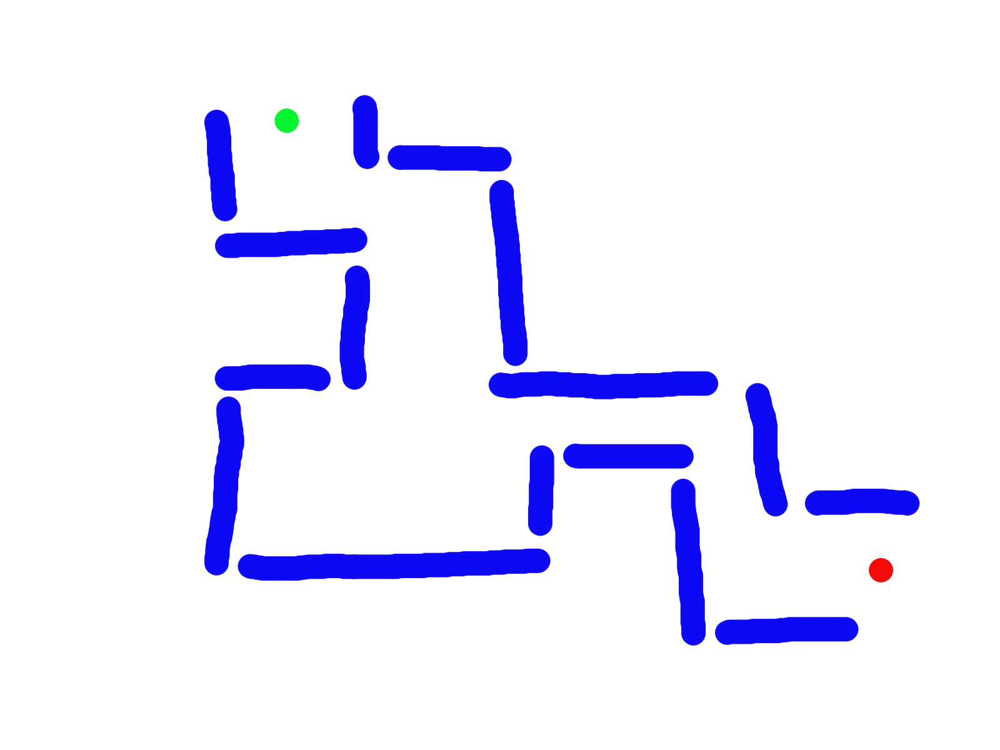
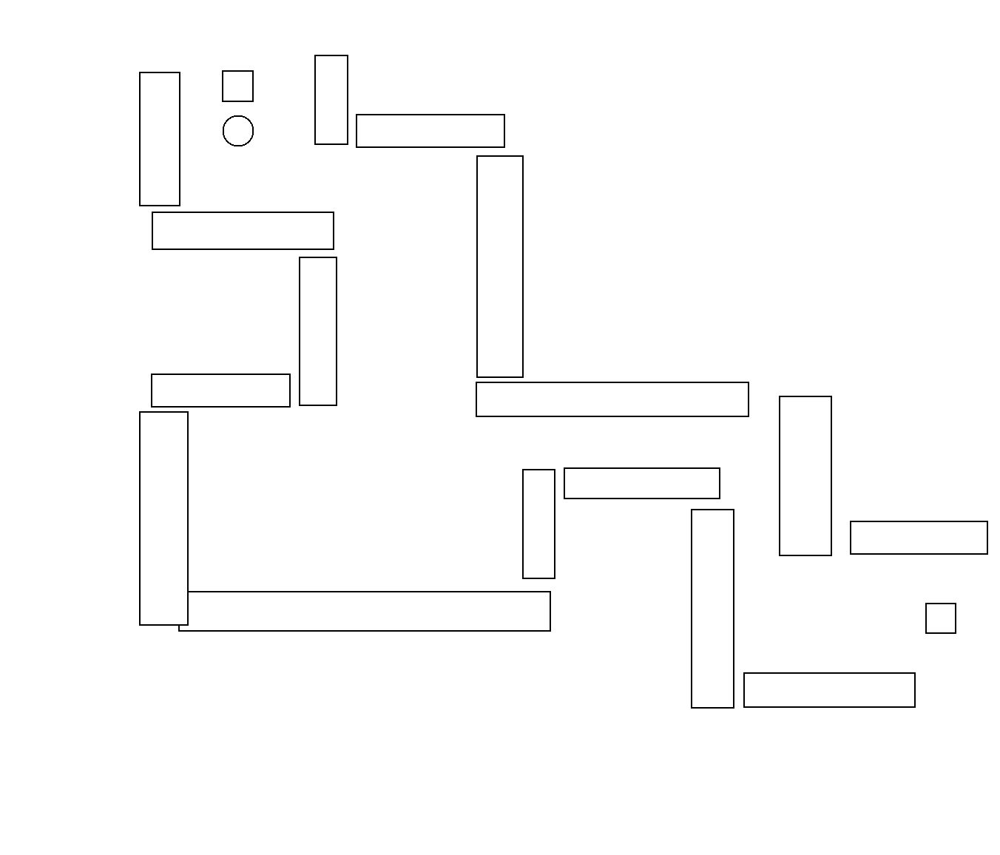

# labyrinth-generator
A labyrinth generator based on a drew labyrinth with specific colors used. Based on computer vision and color detection.

## How to use
1. Install the requirements
2. Put the picture with red point, and green point with wall in blue, like this picture :

3. Run the laby_gene.iynp file to generate the labyrinth and move your player inside

4. Enjoy !

## Goal of this study
This project is a study of computer vision and color detection. The goal is to create a labyrinth generator based on a picture of a labyrinth with specific colors used. The colors used are red for the end point, green for the start point and blue for the wall. The labyrinth is generated with a depth-first search algorithm. The player can move inside the labyrinth with the arrow keys.

